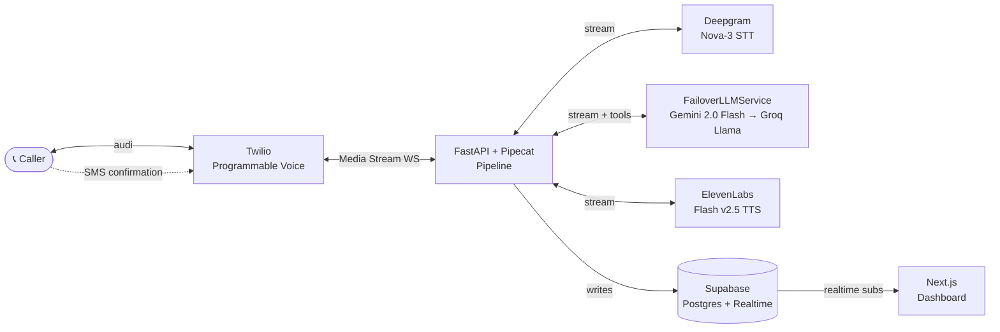

# Voice AI Receptionist for Home Services

> 📞 **Call Mike anytime** — talk to the AI receptionist for Acme Plumbing. He answers in ~1 second of perceived latency, books your appointment, sends an SMS confirmation, and escalates emergencies to the on-call plumber.
>
> 📊 **[Live dashboard](https://voice-ai-receptionist-dashboard.vercel.app)** — real-time transcripts, bookings, and per-call latency analytics.
>
> 🎬 **90-second Loom walkthrough** — *link shared at outreach time.*

*The voice agent runs 24/7 on Render (free tier) with UptimeRobot keep-alive. Dashboard on Vercel. $0/month total.*

---

## The problem

A plumber lying under a sink doesn't pick up the phone. Neither does an electrician already driving home at 7pm. For home-service trades — plumbers, HVAC, electricians, cleaners — the phone *is* the storefront, and a call that rings out is usually a lost job: the caller just dials the next business on Google.

Industry surveys put missed-call rates near **30%**, mostly after hours and mid-job. At roughly **$50 of expected revenue per missed call**, a small shop bleeds hundreds of dollars a week. The usual fixes don't fit: a human answering service costs hundreds a month and still can't see the calendar or book the slot, and voicemail just turns into "I'll call you back" (they won't).

## The solution

**Mike** is a voice agent that answers every call, talks like an actual receptionist, and books the job before hanging up. The caller describes the issue ("my water heater's leaking"); Mike works through service type → urgency → name → address → preferred time, writes the appointment into Postgres, and texts back a confirmation — at about **one second of perceived response time**, so it doesn't feel like a phone tree. If it hears an emergency ("burst pipe", "flooding", "gas smell"), it drops the booking script and SMS-pages the on-call tech instead.

Under the hood it's a streaming voice pipeline — telephony → speech-to-text → LLM with function calling → text-to-speech — tuned for low latency and built to fail over gracefully between model providers, with every call logged to a live dashboard. The rest of this README is how that's put together.

## Demo flow

1. Caller dials the Twilio number.
2. Mike answers: *"Acme Plumbing, this is Mike. What's going on today?"*
3. Caller describes the issue (e.g., "I have a leaking faucet").
4. Mike asks: service type → urgency → name → address → preferred time → confirm.
5. Booking is written to Postgres. Caller gets an SMS confirmation. Live dashboard updates in real time.
6. If caller says emergency keywords ("burst pipe", "flooding", "gas smell"), Mike skips the booking flow and SMS-pages the on-call number.

## Architecture



## Latency budget

| Step | Budget | Provider |
|---|---|---|
| Audio → STT first token | ~150ms | Deepgram Nova-3 |
| LLM TTFT | ~400ms | Gemini 2.0 Flash (primary) · ~250ms on Groq fallback |
| TTS first byte | ~200ms | ElevenLabs Flash v2.5 |
| Twilio + network | ~200ms | — |
| **Total perceived** | **~950ms** | first-word-to-first-word |

Each call's actual `stt` / `llm` / `tts` latency is instrumented per-turn, persisted to Postgres, and surfaced live in the dashboard's `/calls/[id]` view.

## Reliability notes

A few things that became real engineering, not just glue:

- **Provider failover, no dead air** — `FailoverLLMService` runs Gemini as primary; on a 429/error it does a bounded retry, then a *sticky* switch to Groq for the rest of the call. If both providers fail, the agent speaks a cached apology and actively hangs up the Twilio leg instead of leaving the caller in silence.
- **Bounded context window** — `SlidingWindowContext` caps the messages sent to the LLM each turn; this is what actually fixed the free-tier tokens-per-minute ceiling that was killing the call after one exchange.
- **Portable tool schemas** — booking tools are declared once as `FunctionSchema` and convert natively to both the Gemini and Groq/OpenAI function-calling formats.

## Tech stack

- **Telephony:** Twilio Programmable Voice + Media Streams
- **Orchestrator:** [Pipecat](https://github.com/pipecat-ai/pipecat) (Python, MIT, open-source)
- **STT:** Deepgram Nova-3 (streaming)
- **LLM:** Gemini 2.0 Flash (primary) with Groq `llama-3.3-70b-versatile` as a sticky fallback — both via native Pipecat function-calling adapters
- **TTS:** ElevenLabs Flash v2.5 (streaming)
- **DB:** Supabase (Postgres + Realtime + RLS)
- **Dashboard:** Next.js 15 + Tailwind + shadcn/ui on Vercel
- **Voice hosting:** Render free tier (Docker, always-on via UptimeRobot keep-alive)
- **Monitoring:** UptimeRobot (5-min pings, public status page)

Detailed design docs — HLD, LLD, and the ADRs behind these decisions — are maintained alongside the project and available on request.

## Run locally

Prerequisites: `uv`, `node 22+` (corepack enabled), and free-tier Twilio + Deepgram + Gemini + Groq + ElevenLabs + Supabase accounts. The `.env.example` template lists every required variable and where to get each key.

```bash
# 1. Clone + install
git clone https://github.com/aditya-shrotriya/voice-ai-receptionist.git
cd voice-ai-receptionist
cp infra/env/.env.example .env
# fill in API keys (the template lists every required var)

# 2. Apply DB schema
make sql-apply

# 3. Run voice agent + dashboard
make voice        # starts FastAPI on :8000
make dash         # in another terminal, starts Next.js on :3000

# 4. For local dev, use ngrok or similar tunnel:
#    ngrok http 8000
#    Then set PUBLIC_BASE_URL in .env to the ngrok URL
#    and point your Twilio number's Voice webhook at <https://xxx.ngrok.app/twilio/voice>
# 5. Call the number.
```

## Deployment

The voice agent and dashboard are deployed to free-tier infrastructure:

| Component | Platform | URL |
|---|---|---|
| Voice agent | Render (Docker, free tier) | `https://voice-ai-receptionist.onrender.com` |
| Dashboard | Vercel | `https://voice-ai-receptionist-dashboard.vercel.app` |
| Uptime | UptimeRobot | Public status page |

- **Voice agent**: Render auto-deploys from `main` using the `Dockerfile` in `apps/voice-agent/` and the `render.yaml` Blueprint at the repo root. UptimeRobot pings `/healthz` every 5 min to prevent Render's 15-min idle spin-down.
- **Dashboard**: Vercel imports the repo with root directory set to `apps/dashboard`.
- **Secrets**: API keys are set in each platform's dashboard, not in code.

## Repo layout

```
.
├── apps/
│   ├── voice-agent/     # Python: FastAPI + Pipecat pipeline (STT→LLM→TTS, tools, failover)
│   │   └── Dockerfile   # Production image (Python 3.12 + uv)
│   └── dashboard/       # Next.js 15: live transcripts, bookings, latency
├── docs/                # HLD, LLD, ADRs, sprint logs (Obsidian-renderable)
├── infra/
│   ├── supabase/        # SQL migrations + seed
│   └── env/             # .env.example (placeholders only)
├── render.yaml          # Render Blueprint — infra-as-code for voice agent
├── .claude/commands/    # project-local slash commands (agile workflow)
└── Makefile
```

## What I'd change in v2

- **Semantic VAD** instead of energy-based VAD to handle "umm"s and pauses more gracefully.
- **Pre-classifier** (Llama 3.2 1B) to route emergency vs booking before the heavy LLM — saves ~200ms when it matters.
- **Per-call audio recording** with timestamped diarization, stored in Supabase Storage.
- **Multi-tenant** business config — each business has its own number, services, hours, prices.

## Built by

Aditya Shrotriya — 2nd-year B.Tech IT, SGSITS Indore. · [GitHub](https://github.com/aditya-shrotriya)
